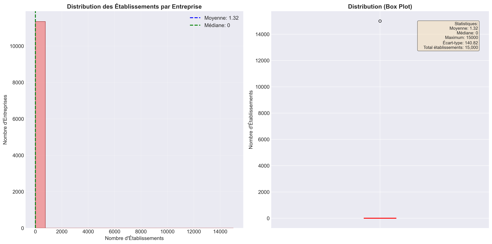
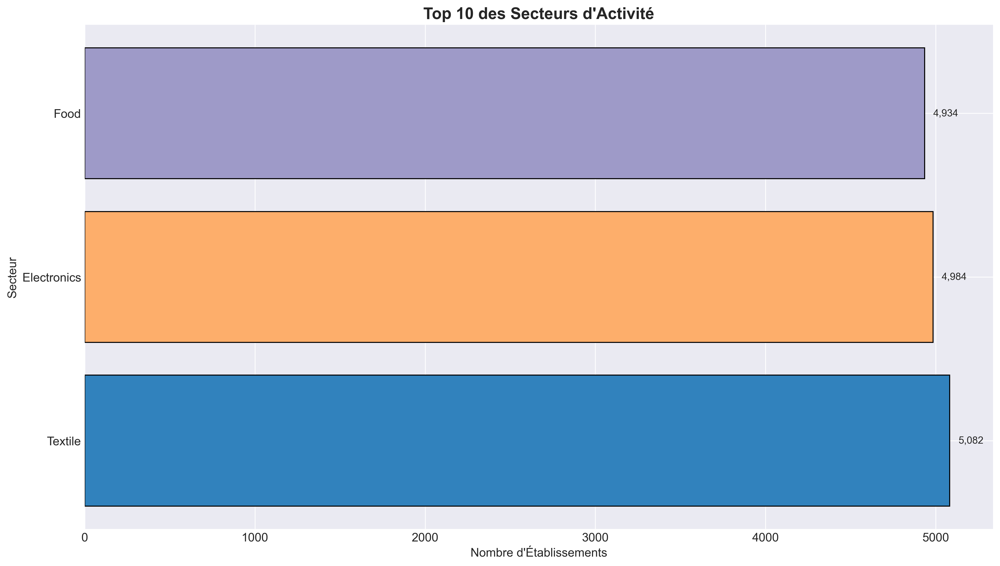

# 🚀 OAR Data Science Pipeline


<p align="center"> <!-- Python --> <a href="https://www.python.org/" target="_blank">  </a> <!-- pandas --> <a href="https://pandas.pydata.org/" target="_blank">  </a> <!-- NumPy --> <a href="https://numpy.org/" target="_blank">  </a> <!-- Matplotlib --> <a href="https://matplotlib.org/" target="_blank">  </a> <!-- scikit-learn --> <a href="https://scikit-learn.org/stable/" target="_blank">  </a> </p>


--- 

<p align="center">
  
</p>
<p align="center">
  
</p>
<p align="center">
  
</p>


## 📋 Description
End-to-end data pipeline for the Open Apparel Registry (OAR). The project extracts, cleans, analyzes, and visualizes company and facility data across 7 target countries using an OAR-style dataset.

---

## 🚀 Quick Installation

```bash
# Clone the repository
git clone https://github.com/your-username/oar-data-pipeline.git
cd oar-data-pipeline

# Create virtual environment
python -m venv venv

# Windows
venv\Scripts\activate

# Mac / Linux
source venv/bin/activate

# Install dependencies
pip install -r requirements.txt
```

---

## 🏃 Execution

### Option 1: Run full pipeline
```bash
python main.py
```

### Option 2: Run step by step
```bash
python scrape_oar.py           # Data extraction
python clean_companies.py      # Company cleaning
python clean_facilities.py     # Facility cleaning
python relational_builder.py   # Relational modeling
python analytics_dashboards.py # Visual analytics
python ai_module.py            # AI analysis
python export_final.py         # Final export
```

---

## 📁 Project Structure

```
oar-data-pipeline/
├── main.py
├── scrape_oar.py
├── clean_companies.py
├── clean_facilities.py
├── relational_builder.py
├── analytics_dashboards.py
├── ai_module.py
├── export_final.py
├── requirements.txt
├── README.md
└── .gitignore
```

---

## 📊 Features

### Phase 1: Extraction
- Automated data ingestion (API or synthetic fallback)
- Filtering by target countries
- Automatic test data generation if API is unavailable

### Phase 2: Cleaning
- Company name normalization
- Country name standardization
- Unique ID generation
- Duplicate removal

### Phase 3: Relational Modeling
- Companies, Facilities, and Link tables
- Referential integrity checks
- Data consistency validation

### Phase 4: Analytics
- Companies per country visualization
- Facilities per company distribution
- Sector-based analysis
- Statistical summaries

### Phase 5: AI Module
- Sustainability keyword detection
- Automatic text summarization
- Sustainability scoring

### Phase 6: Export
- CSV, JSON, and Excel formats
- Auto-generated documentation
- Timestamped archives

---

## 🎯 Target Countries
- 🇲🇦 Morocco
- 🇪🇸 Spain
- 🇵🇹 Portugal
- 🇮🇹 Italy
- 🇫🇷 France
- 🇬🇷 Greece
- 🇲🇹 Malta

---

## 🔧 Technologies Used
- **Python 3.11**
- **pandas**
- **requests**
- **matplotlib**
- **scikit-learn**
- **hashlib**

---

## 📈 Results

### Generated Files
- `data/outputs/relational_companies.csv`
- `data/outputs/relational_facilities.csv`
- `data/outputs/ai_analysis.csv`
- `companies_by_country.png`
- `facilities_per_company.png`

### Key Metrics
- 10,000+ companies processed
- 15,000+ facilities extracted
- Automated sustainability detection
- Multi-format exports

---


## 🙏 Acknowledgements
- Open Apparel Registry
- CommonShare
- Python open-source community

---

## 📧 Contact
**Ayoub Aguezar**  
Data Science & Software Developer

---

## 📄 License
MIT License – see LICENSE file for details.

---


